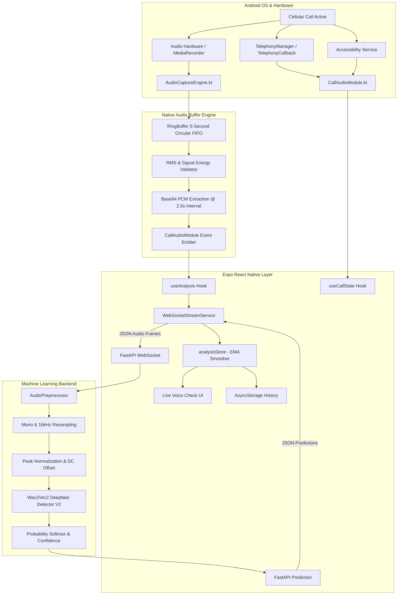

# VoiceGuard — Complete System Architecture

## Data Flow Details

1. **Call Detection Pipeline**:
   - `CallStateReceiver.kt` hooks into Android's `TelephonyManager` (using `TelephonyCallback` on API 31+ or `PhoneStateListener` on legacy Android).
   - Emits unified events (`IDLE`, `RINGING`, `ACTIVE`, `ENDED`) across the React Native bridge.
   - `VoiceGuardAccessibilityService.kt` monitors in-call dialer package transitions as a secondary coordination channel.

2. **Audio Capture Pipeline**:
   - Background audio capture runs on a high-priority native worker thread (`AudioCaptureEngine.kt`) via `AudioRecord`.
   - Audio is captured at 16,000 Hz, 16-bit Mono PCM.
   - Pushed directly to a thread-safe circular `RingBuffer` with 5-second rolling window capacity (160,000 bytes).
   - Rolling windows are dispatched at 2.5-second intervals to prevent thread starvation and provide low latency.

3. **Inference Pipeline**:
   - Chunks are transmitted over `WebSocket /ws/analyze` to the FastAPI backend.
   - Preprocessed to exact model input specifications (1D float32 tensor normalized in `[-1.0, 1.0]`).
   - Evaluated by `MelodyMachine/Deepfake-audio-detection-V2` / `Gustking/wav2vec2-large-xlsr-deepfake-audio-classification`.
   - Predictions returned with `aiRisk`, `realProbability`, `confidence`, `timestamp`, and `inferenceTimeMs`.

4. **Mobile Smoothing & UX**:
   - Exponential Moving Average (EMA) smoothing:
     $$EMA_t = 0.35 \cdot RawRisk_t + 0.65 \cdot EMA_{t-1}$$
   - Prevents erratic gauge needle jumps while staying reactive to actual speech transitions.
